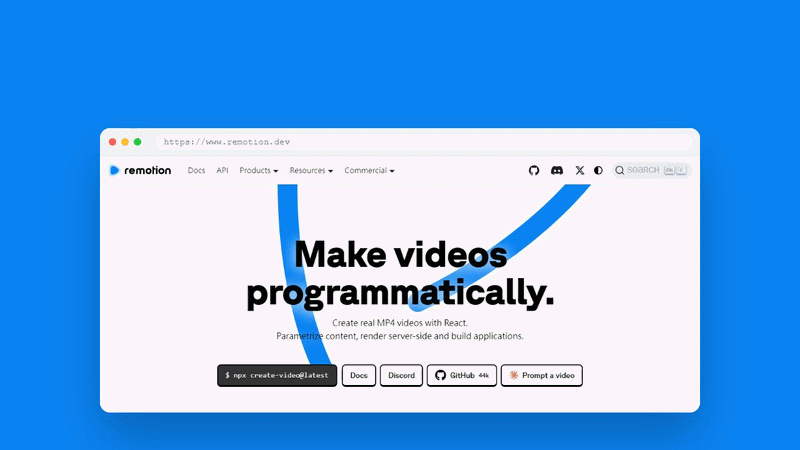

<div align="center">

# LumeSpec

### Turn any webpage into a polished demo video. In 60 seconds.

*Stop spending 3 days in Figma. Paste a URL, hit enter, ship.*

[](LICENSE)
[](https://nodejs.org)
[](https://www.typescriptlang.org)
[](https://anthropic.com)
[](https://remotion.dev)
[](CONTRIBUTING.md)

<br/>



<br/>

**Every SaaS founder knows the pain:** your product ships, and suddenly you need a crisp demo video — yesterday. Screen recordings look amateurish. Motion designers cost thousands. And the moment you update your UI, everything is stale anyway.

LumeSpec fixes this permanently. Paste your product URL, describe the story you want to tell, and our AI pipeline — powered by Claude 3.5 Sonnet and Remotion — generates a pixel-perfect, code-driven demo video in under a minute. No editing software. No reshoots. No stale assets. And yes — every video ships with our **"Made with LumeSpec"** badge in the corner, because the best demo of our product is *made by* our product.

</div>

---

## The Magic Behind LumeSpec

<table>
<tr>
<td width="33%" valign="top">

### 🧠 Creativity Engine

Claude 3.5 Sonnet doesn't just scrape your page — it **understands your industry**. It detects whether you're fintech, devtools, or e-commerce and injects the right tone, vocabulary, and narrative arc into every scene. The result feels like a copywriter spent a week with your product.

Bilingual by design: Chinese or English intent text produces a matching storyboard — no translation layer, no quality loss.

</td>
<td width="33%" valign="top">

### 🎬 Pixel-Perfect Rendering

Powered by [Remotion](https://remotion.dev), your video is **compiled from React code** — not screen-captured. That means deterministic layouts, smooth 30fps spring animations, and brand colors extracted live from your site. Rerun any time your UI changes; the output updates with it.

A 7-layer defense pipeline catches and repairs every edge case Claude might produce — so you never get a broken render at 3am.

</td>
<td width="33%" valign="top">

### 🚀 Built for Growth (PLG)

Your **History Vault** stores every video you've ever generated. Fork any past job to remix the storyboard without re-crawling. Download as MP4 in one click. Free-tier videos include a tasteful "Made with LumeSpec" badge that markets itself — upgrade to Pro for the white-label experience.

Your demo library grows with your product.

</td>
</tr>
</table>

---

## The Interface Feels as Premium as the Output

LumeSpec's UI is a dark glassmorphic shell — deep violet gradients, frosted-glass cards, and SSE-powered live progress bars that update in real time as your video renders. We built it this way deliberately: the tool you use to make first impressions should make one itself. Every interaction — from pasting a URL to clicking Download — is designed to feel effortless and a little bit magical.

<details>
<summary>Why this matters for your brand</summary>

When you share a LumeSpec-generated video, the production value signals "this team ships quality." The interface you used to make it reflects the same standard. It's not cosmetic — it's product philosophy.

</details>

---

## How It Works

```
URL + Intent
    │
    ▼
┌─────────────────────────────────────────────────────────────┐
│  1. CRAWL      Playwright extracts copy, brand colors,      │
│                and DOM structure from your live page        │
│                ────────────────────────────────────────     │
│  2. THINK      Claude 3.5 Sonnet generates a Storyboard     │
│                JSON — scenes, durations, transitions, copy  │
│                ────────────────────────────────────────     │
│  3. RENDER     Remotion compiles the storyboard into a      │
│                1280×720 H.264 video, scene by scene         │
│                ────────────────────────────────────────     │
│  4. DELIVER    MP4 uploaded to S3; SSE stream shows live    │
│                progress in your browser                     │
└─────────────────────────────────────────────────────────────┘
    │
    ▼
 demo.mp4  ✓  (ready in ~60 seconds)
```

Each stage runs in an **isolated BullMQ worker** — the crawl worker never touches the render queue, and the render worker never calls Claude. If any stage fails, it retries independently without restarting the whole pipeline. Stability at scale, by design.

<details>
<summary>Full architecture diagram</summary>

```
Browser / CLI
     │
     ▼
apps/web (Next.js 15)          ← Landing page, History Vault, auth UI
     │  X-User-Id proxy header
     ▼
apps/api (Fastify)             ← Job lifecycle, credit gate, SSE stream
     │  BullMQ queues
     ├──▶ workers/crawler      ← Playwright + brand-color extraction
     ├──▶ workers/storyboard   ← Creativity Engine (Claude storyboard gen)
     └──▶ workers/render       ← Remotion → MP4 → S3 upload
```

Each worker runs in its own Node process with its own Redis connection. The web tier talks to the API via a trusted same-origin proxy header — end-user browsers never reach the API directly.

See [docs/readme/design-decisions.md](docs/readme/design-decisions.md) for the full rundown: why progress lives in Redis (not Postgres), the 7-layer Claude output defense, the Windows PID-tracking fix, and every other non-obvious call we made.

</details>

---

## Quickstart

**Prerequisites:** Node ≥ 20, pnpm ≥ 9, Docker Desktop

```bash
# 1 · Clone and install dependencies
git clone https://github.com/chadcoco1444/LumeSpec.git
cd LumeSpec
pnpm install

# 2 · Boot infrastructure (Postgres + Redis + MinIO, all in Docker)
pnpm infra:up

# 3 · Configure your environment (only one key is truly required)
cp apps/web/.env.example apps/web/.env.local
cp apps/api/.env.example apps/api/.env
# → Set ANTHROPIC_API_KEY in apps/api/.env
# → Set NEXTAUTH_SECRET in apps/web/.env.local (any random string works locally)

# 4 · Launch everything
pnpm lume start
# → Web UI at   http://localhost:3001
# → API health  http://localhost:3000/healthz
```

> **Free tier** auto-seeds 30 credits on first sign-in — enough to generate ~5 full videos without touching billing config.

### Optional: Enable Google OAuth + full auth flow

```bash
# In apps/web/.env.local:
AUTH_ENABLED=true
GOOGLE_CLIENT_ID=...
GOOGLE_CLIENT_SECRET=...
NEXTAUTH_URL=http://localhost:3001
```

### Dev commands

```bash
pnpm lume status          # check which services are running
pnpm lume stop            # clean shutdown — no zombie processes
pnpm lume render:promo    # re-render the PromoComposition marketing video
pnpm test                 # full test suite (188 tests across 33 files)
pnpm typecheck            # type-check the whole monorepo
```

---

## Built with the Best of the Modern Web

| Layer | Technology | Why it's the right call |
|---|---|---|
| **Frontend** | Next.js 15 · Tailwind CSS · shadcn/ui | App Router, RSC, and a design system that doesn't fight you |
| **Animations** | Framer Motion | Spring physics for the landing page; Remotion for inside the video |
| **AI** | Anthropic Claude 3.5 Sonnet | Best structured JSON generation + industry tone reasoning available |
| **Video** | Remotion 4 | Code-driven rendering — deterministic, versionable, and GPU-accelerated |
| **Queue** | BullMQ + Redis | Isolated worker stages with built-in retry, backpressure, and visibility |
| **Crawler** | Playwright | Full Chromium — handles SPAs, lazy images, and dark-mode screenshots |
| **Database** | PostgreSQL + Drizzle ORM | Type-safe migrations, credit ledger, job lifecycle tracking |
| **Storage** | AWS S3 / MinIO | Presigned download URLs, per-tier retention policies |
| **Auth** | NextAuth.js v5 | GitHub + Google OAuth; database sessions; trusted proxy forwarding |

---

## What's Coming Next

We're building the fastest path from "product exists" to "demo is live." The roadmap is driven by what the community asks for most.

| Status | Feature | Why it matters |
|---|---|---|
| 🔜 **Up next** | **History thumbnails** — first-frame preview for every job | Browse your vault visually, not just by title |
| 🔜 **Up next** | **Bento grid scenes** — asymmetric card layout with spring microanimations | A richer visual language for feature callouts |
| 💡 **Planned** | **Scheduled re-renders** — cron-triggered re-crawl when your site updates | Your demo stays fresh automatically |
| 💡 **Planned** | **Custom brand kit** — save your palette and fonts once, apply everywhere | Zero-config brand consistency across every video |
| 💡 **Planned** | **9:16 vertical video** — TikTok / Reels / Shorts format with auto-reflow | One product, every platform |
| 💡 **Planned** | **Team workspaces** — shared History Vault with role-based access | Built for teams who ship together |
| 💡 **Planned** | **Webhook / CI trigger** — auto-generate on every deploy | The closest thing to a living demo |

**Want to move something up the list?** Open an issue with a 👍 reaction — the most-voted features get prioritized.

---

## Contributing

LumeSpec is built in the open. Every PR — from typo fixes to new scene types — is welcome.

- **Found a bug?** [Open an issue](https://github.com/chadcoco1444/LumeSpec/issues)
- **Have a scene idea?** The renderer is modular; each scene is a self-contained React component in `packages/remotion/src/`
- **Want to add a voiceover engine, crawling strategy, or new worker?** [Start a Discussion](https://github.com/chadcoco1444/LumeSpec/discussions)

See [docs/readme/demo-gif-howto.md](docs/readme/demo-gif-howto.md) for instructions on recording and compressing the demo GIF.

---

<div align="center">

**If LumeSpec saved you an hour of video editing, consider starring the repo — it helps more developers find it.**

[⭐ Star on GitHub](https://github.com/chadcoco1444/LumeSpec) · [Open an Issue](https://github.com/chadcoco1444/LumeSpec/issues) · [Start a Discussion](https://github.com/chadcoco1444/LumeSpec/discussions)

<sub>MIT License · Built with Claude + Remotion · The demo GIF above was generated by LumeSpec itself.</sub>

</div>
