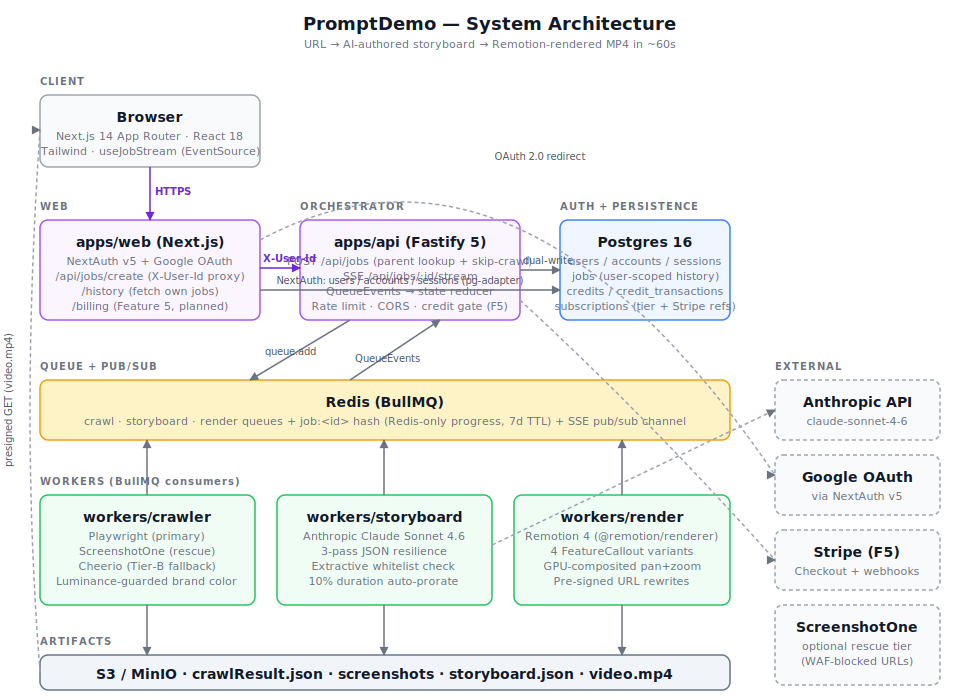

<p align="center">
  
</p>

<h1 align="center">PromptDemo</h1>

<p align="center">
  Turn any URL into a 10 / 30 / 60-second demo video.<br/>
  Playwright crawls the page · Claude writes the storyboard · Remotion renders the MP4.
</p>

<p align="center">
  
  
  
  
  
  
</p>

---

## What it does

1. **Paste any product URL** in the web form.
2. **Describe what to emphasize** — or click one of 5 preset chips (Executive Summary · Tutorial · Marketing Hype · Technical Deep-Dive · Customer Success Story), bilingual EN / 中 toggle.
3. **Hit Create.** In about a minute, you get a 10/30/60-second MP4 authored from the page's own copy and screenshots.

No human editor in the loop. The storyboard only uses text the crawler actually extracted (an extractive-check layer rejects anything Claude invents).

---

## Features

| | |
|---|---|
| 🎬 **4 FeatureCallout variants** | Real screenshot · Ken Burns pan+zoom on the full-page capture · 3-up collage slice · stylized dashboard fallback. Variant selected deterministically post-LLM. |
| 💬 **5 intent presets, bilingual** | English / 中 toggle; body AND append marker both follow the chosen language. Bilingual dedup prevents duplicate stuffing on re-clicks. |
| 🎨 **Dark / light / system theme** | Tailwind `darkMode: 'class'`. Pre-hydration script applies the saved preference BEFORE first paint — no flash of wrong theme. |
| 🔐 **Google OAuth + History** | NextAuth v5 + Postgres. Signed-in users see their past renders at `/history`, can regenerate from any job with a hint. |
| 🔄 **Regenerate with hint** | Parent `jobId` lookup is server-side — skips the crawl stage entirely, reuses the parent's crawlResultUri, saves ~30s. Security-hardened: client-supplied crawlResultUri is ignored. |
| 🛡️ **7-layer LLM defense** | JSON auto-repair, balanced-brace extractor, list-separator extractive check, Zod integer coercion, smart-quote normalization, 10% duration auto-prorate, sceneId array-index fallback. See [design decisions](docs/readme/design-decisions.md). |
| 🚀 **One-command local dev** | `pnpm demo start` brings up Docker (Redis + MinIO + Postgres) + 5 Node services on Windows / macOS / Linux. `db:reset` / `db:tables` / `clean-all` / `status` subcommands included. |
| ♿ **Accessibility baked in** | Focus-visible rings on every button, `role="group"` on chip rows, proper aria-labels, `suppressHydrationWarning` scoped to exactly the nodes that legitimately differ server vs. client. |

---

## Architecture

<p align="center">
  
</p>

### The happy path

1. Browser POSTs to `/api/jobs/create` (a same-origin Next.js proxy). If authenticated, the proxy adds `X-User-Id` and forwards to Fastify.
2. Fastify validates the payload, creates a job record, enqueues to `crawl` queue. Returns `jobId` + `201`.
3. Browser opens an SSE connection to `/api/jobs/:id/stream`.
4. **Crawler** pulls the job, runs Playwright → captures viewport + full-page screenshots, extracts features/text/brand color. Uploads `crawlResult.json` to S3. Marks completed.
5. **Orchestrator** sees crawl completed, enqueues to `storyboard` with the `crawlResultUri`.
6. **Storyboard worker** calls Claude Sonnet 4.6 with the extracted content + user intent. Runs the 3-pass JSON parser, extractive whitelist check, duration auto-prorate, variant selector. Uploads `storyboard.json` to S3. Marks completed.
7. **Orchestrator** enqueues to `render` queue (subject to a global cap so we don't DoS our own Remotion bundler).
8. **Render worker** reads both artifacts, runs Remotion composition, uploads `video.mp4` to S3. Marks completed.
9. Browser's SSE stream reports `done`, switches to a `<video>` element pointed at the presigned MP4 URL.

Progress updates flow the whole way through as BullMQ `progress` events → orchestrator → SSE broker → browser.

### Why this shape

- **Three distinct workers, one per stage** rather than a monolithic pipeline: each failure mode is isolated (crawl-404 never blocks render; LLM hiccup doesn't retry Playwright). Per-queue concurrency caps are per-stage — we can run 3 crawlers but only 1 render at a time.
- **Redis as queue + progress pub/sub, Postgres as long-term history.** Progress updates fire ~5×/sec during render — writing those to Postgres would be a WAL storm. Postgres only sees status/stage transitions (~5 writes per job lifecycle). See [Amendment A](docs/readme/design-decisions.md#amendment-a-progress-stays-in-redis).
- **Same-origin Next.js proxy for API calls** keeps NextAuth session handling on the web side; Fastify just reads the trusted `X-User-Id` header. Production deploy MUST strip client-supplied `X-User-Id` at the ingress — see [security](#security-notes).

---

## Tech stack

| Frontend | Backend | Infra / Ops | Tooling |
|---|---|---|---|
| Next.js 14 App Router | Fastify 5 | Docker Compose (dev) | pnpm workspaces |
| React 18 | BullMQ 5 on Redis 7 | Cloud Run (prod target) | Vitest |
| Tailwind 3 | Anthropic SDK 0.30 | Postgres 16 + `@auth/pg-adapter` | `@testing-library/react` |
| Remotion 4 | Playwright 1 | MinIO (dev) / AWS S3 (prod) | TypeScript strict mode |
| NextAuth v5 | Zod 3 (shared schemas) | GitHub Actions (planned) | Changesets (planned) |

---

## Quickstart — local dev

**Prerequisites**: Docker Desktop, Node 22+, pnpm 9+, an Anthropic API key.

```bash
git clone https://github.com/chadcoco1444/PromptDemo.git
cd PromptDemo
pnpm install

# Copy env template and add your Anthropic key
cp .env.example .env
#   edit .env and set ANTHROPIC_API_KEY=sk-ant-...

# One command: docker compose up + spawn 5 services in background
pnpm demo start

# Open the web UI
# → http://localhost:3001
```

That's it. Paste a URL, pick a preset, click Create.

### Enabling auth + history (optional)

```bash
# 1. Set up Google OAuth at https://console.cloud.google.com/apis/credentials
#    Authorized redirect URI: http://localhost:3001/api/auth/callback/google

# 2. Edit .env — add your creds and a random secret
#    (generate with: node -e "console.log(require('crypto').randomBytes(32).toString('hex'))")
#    GOOGLE_CLIENT_ID=...
#    GOOGLE_CLIENT_SECRET=...
#    AUTH_SECRET=<64-char hex>
#    AUTH_ENABLED=true

# 3. Reset Postgres volume + apply schema
pnpm demo db:reset

# 4. Restart
pnpm demo start
```

Visit `http://localhost:3001`, click Sign In, complete Google OAuth. You'll land back with a History link in the nav.

---

## `pnpm demo` command reference

| Command | What it does |
|---|---|
| `pnpm demo start` | Docker up + wait for Redis/MinIO/Postgres + spawn 5 services |
| `pnpm demo stop` | Kill services, Docker down |
| `pnpm demo restart` | Stop + start |
| `pnpm demo status` | Infra health (with table + row counts when `AUTH_ENABLED`) + service listening checks |
| `pnpm demo test` | End-to-end smoke: POST /api/jobs, poll until done, verify MP4 |
| `pnpm demo logs [svc]` | Tail logs (all services, or one of `crawler`/`storyboard`/`render`/`api`/`web`) |
| `pnpm demo run` | Foreground mode — mixed output, Ctrl-C stops |
| `pnpm demo clean` | Remove stale Remotion webpack bundles from OS temp |
| `pnpm demo clean-all --yes` | Nuclear option: kill every `node`/`pnpm`/`tsx`/`cmd` process whose command line touches this repo |
| `pnpm demo db:reset` | Wipe Postgres volume + rerun migrations |
| `pnpm demo db:tables` | List DB tables + row counts |

### Running tests

```bash
pnpm -r test
# → 268+ tests across:
#   @promptdemo/schema                (50)
#   @promptdemo/worker-storyboard     (68)
#   @promptdemo/remotion              (25)
#   @promptdemo/web                   (86)
#   @promptdemo/api                   (39)
```

---

## Project structure

```
apps/
  api/               Fastify orchestrator + BullMQ producer + SSE broker
  web/               Next.js 14 frontend + NextAuth + /history + trusted proxy
workers/
  crawler/           Playwright + ScreenshotOne (rescue) + Cheerio (Tier-B)
  storyboard/        Anthropic Claude client + validation stack + prompt templates
  render/            Remotion renderer + pre-signed URL resolver + BGM handling
packages/
  schema/            Shared Zod schemas (Job / Storyboard / CrawlResult)
  remotion/          Remotion compositions + FeatureCallout variants + tests
scripts/
  demo.mjs           850-line lifecycle manager (db:reset, clean-all, status, logs…)
  lib/               devCommand resolver (used by spawn)
db/
  migrations/        Auto-applied on `up -d postgres` via docker-entrypoint-initdb.d
docs/
  superpowers/       Design specs + implementation plans + followup guides
  readme/            Architecture SVG + design-decisions writeup
```

---

## Design decisions (the fun stuff)

The hard calls are written up in [`docs/readme/design-decisions.md`](docs/readme/design-decisions.md):

- **Why progress stays in Redis, not Postgres** (Amendment A — WAL storm math)
- **Why we chose Option C for bilingual presets** (Chinese intent → Claude, despite the quality tradeoff)
- **The 7-layer Claude output defense** and how each failure mode was found
- **Why `JOB_OBJECT_UILIMIT_DESKTOP` is the known-hard followup** for Windows terminal hiding
- **Why `z.coerce.number()` without `.int().positive()` guards is a NaN trap**
- **Why direct-node spawn beats pnpm.cmd wrapping for PID tracking**

---

## Security notes

- **OAuth creds live in `.env` only** (`.env` is gitignored). `.env.example` has the skeleton with blanks.
- **`X-User-Id` is a trusted same-origin header.** The apps/web Next.js proxy reads the NextAuth session server-side and sets the header. Fastify trusts it. **Production deploy MUST strip any client-supplied `X-User-Id` at the ingress layer** (Cloud Run, API Gateway, or an Nginx block) — otherwise any client could forge identity. See [the followup guide](docs/superpowers/followups/2026-04-25-feature4-auth-history-guide.md).
- **Parent URI inheritance is server-authoritative.** When regenerating with a `parentJobId`, the API looks up the parent's `crawlResultUri` from its own store; a client-supplied URI in the request payload is ignored (regression test in `apps/api/tests/postJob.test.ts`).
- **Stripe webhook signature verification happens before idempotency dedupe** (Feature 5, planned).

---

## Deployment

Target: Cloud Run. Scripts under `deploy/` provision Artifact Registry, GCS bucket, Memorystore Redis, Secret Manager, and deploy each service as its own Cloud Run service. See the deploy plan in `docs/superpowers/plans/` for details. A dry-run Cloud Run deploy completes in ~3 minutes per service.

---

## Roadmap

- ✅ Feature 1 — FeatureCallout variants (image / Ken Burns / collage / dashboard)
- ✅ Feature 2 — Intent presets with bilingual toggle
- ✅ Feature 3 — Theme toggle, stage rail, micro-interactions, dark mode
- ✅ Feature 4 — Google OAuth, history, regenerate with skip-crawl
- 🚧 Feature 5 — Credits + tier enforcement + /billing (Stripe integration pending keys)
- 📋 SSE live-intel per stage (Playwright track, token count, frame counter)
- 📋 Windows terminal hiding via Job Objects
- 📋 Bento variant (deferred to v2.1 per original spec)

Detailed specs + implementation plans live under [`docs/superpowers/`](docs/superpowers/).

---

## Contributing

Issues + PRs welcome. Please:
1. Run `pnpm -r test && pnpm -r typecheck` before opening a PR.
2. Match the existing Zod schema → Postgres → TS type flow for any new persisted field.
3. Add a test that captures the failure mode you're fixing (especially for LLM-output edge cases).

---

## License

MIT.
