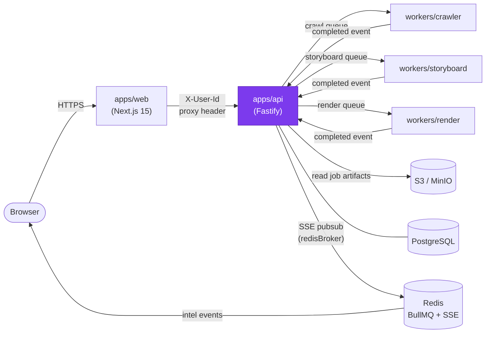

# apps/api — Design Document

> **[AI 開發人員強制指令 / AI Dev Directive]**
> 當你在這個模組下新增任何檔案或修改任何程式邏輯前，你 **必須 (MUST)** 先重新檢視本 `DESIGN.md`。若你的實作方案與本文件的架構規範、職責邊界或設計模式產生衝突，你必須修正你的實作方案以符合設計規範；若你認為必須打破規範，你必須在輸出程式碼前，明確向 User 提出警告並說明原因。

---

## 系統定位 (System Position)

`apps/api` 是整個 LumeSpec 的**神經中樞**。所有任務的生命週期（建立、排隊、協調、計費、失敗補償）都在此發生。它是唯一可以寫入 PostgreSQL 業務資料的服務，也是唯一持有 BullMQ Queue 控制權的服務。



**此模組是唯一允許：**
- 將任務加入 BullMQ Queue 的服務
- 寫入 `jobs`、`credits`、`credit_transactions`、`subscriptions` 資料表的服務

---

## 模組職責 (Responsibilities)

- **REST API** — 接收來自 `apps/web` BFF 的請求，提供任務建立（`POST /api/jobs`）、狀態查詢（`GET /api/jobs/:id`）、用戶歷史與額度（`GET /api/users/me/jobs`、`GET /api/users/me/credits`，皆以內部 JWT 驗證）
- **SSE 進度串流** — 透過 Redis Pub/Sub (`redisBroker`) 將 Worker 的即時進度轉發給瀏覽器（`GET /api/jobs/:id/stream`）
- **Orchestrator** — 監聽 BullMQ QueueEvents，依 `crawl → storyboard → render` 的流水線順序串接佇列
- **信用點數閘門** — 任務建立時扣款（`debitForJob`），任務失敗時退款（`refundForJob`）；使用 `SELECT … FOR UPDATE` 防止競爭條件
- **Anthropic 花費守衛 (`credits/spendGuard`)** — Orchestrator 在 `crawl:completed` 將任務丟入 storyboard queue 前呼叫 `assertBudgetAvailable`；在 `storyboard:completed` 從 worker 回傳的 `anthropicUsage` 呼叫 `recordSpend`。此責任**過去在 storyboard worker**，2026-04 隨 Spec 3 R2 搬入此處以維持「Worker 不接 PG」的鐵律
- **退款補償** — Orchestrator 監聽 `storyboard.failed` / `render.failed` 事件，自動觸發 `refundForJob`
- **歷史保留 Cron** — `cron/retentionCron.ts` 透過 BullMQ Repeatable Job (`jobId='retention-daily'`、cron `0 3 * * *`、`Worker(concurrency=1, lockDuration=300_000)`) 每日刪除超過保留期限的任務記錄（Free=30天，Pro=90天，Max=365天）。**多副本部署下 BullMQ 在 Redis 端去重，N 個 instance 只會排出一筆任務**
- **PG mirror reconciliation primitive (`jobStorePostgres.upsert()`)** — idempotent INSERT-or-UPDATE used by `pg-backfill` worker (added in T2) to land current Redis state into PG. OCC-guarded by `WHERE jobs.updated_at < EXCLUDED.updated_at` so stale reads can't regress PG state.

---

## 關鍵介面與資料流 (Key Interfaces & Data Flow)

### 任務建立流程

```
POST /api/jobs
  → 身份驗證 (X-User-Id header，由 apps/web 注入)
  → 信用點數扣款 (debitForJob, SELECT FOR UPDATE)
  → crawlQueue.add({ jobId, url, userId, showWatermark })
  → 回傳 { jobId }
```

### 協調器事件鏈

```
crawlEvents.completed
  → 從 S3 下載 crawlResult.json
  → assertBudgetAvailable(creditPool)        ← Anthropic 日花費 gate（pricingEnabled 時）
      ↳ BudgetExceededError → reduceEvent('storyboard:failed', BUDGET_EXCEEDED) → return
  → storyboardQueue.add({ jobId, crawlResultUri, showWatermark })

storyboardEvents.completed
  → 反壓機制檢查 (backpressure.ts, renderQueueDepth)
  → renderQueue.add({ jobId, storyboardUri })
  → recordSpend(creditPool, parsed.anthropicUsage)   ← 記錄 worker 累積的 Claude token 花費

storyboardEvents.failed | renderEvents.failed
  → refundForJob(jobId)
```

### SSE 進度廣播

Worker 呼叫 `job.updateProgress(intelPayload)` → BullMQ QueueEvents `progress` 事件 → `redisBroker.publish(jobId, intel)` → 瀏覽器 EventSource 接收

### QueueBundle 介面

```typescript
interface QueueBundle {
  crawl: Queue;
  storyboard: Queue;
  render: Queue;
  retention: Queue;          // BullMQ Repeatable Job 用，不接事件
  crawlEvents: QueueEvents;
  storyboardEvents: QueueEvents;
  renderEvents: QueueEvents;
}
```

### 用戶資料路由（內部 JWT 驗證）

```
GET /api/users/me/jobs    → verifyInternalToken → pgPool 查詢 jobs + tier → { jobs, hasMore, tier }
GET /api/users/me/credits → verifyInternalToken → pgPool 查詢 credits     → { balance, tier, allowance, ... }
```

- 兩個路由都要 `Authorization: Bearer <JWT>`，由 apps/web 用 `signInternalToken(userId)` 在 server 端鑄造
- `pgPool` 在 `AUTH_ENABLED=true` 時注入；當 pool 為 null 兩條路由都不註冊（會回 404）
- SQL 結構與分頁邏輯都在 `routes/getUserJobs.ts` / `routes/getUserCredits.ts`，**不在 apps/web**

---

## 🚫 反模式 (Anti-Patterns)

### 1. 將即時進度寫入 PostgreSQL
進度是高頻瞬態資料（每秒多次更新）。寫入 DB 會引發嚴重的 WAL Storm，打爆連線池。**進度只能存活在 Redis，透過 SSE 廣播後即消失。** DB 只記錄最終狀態（`pending → processing → done / failed`）。

### 2. Fat Controller — 在 Route Handler 中直接操作資料庫
Route Handler 只做三件事：解析輸入、呼叫 Service 層、回傳結果。業務邏輯（扣款、協調、退款）必須在 `orchestrator/`、`credits/`、`cron/` 等 Service 模組中。直接在 Route 裡寫 SQL 是職責邊界崩潰的開始。

### 3. 忽略非循序事件（Out-of-Order Events）
BullMQ 在高並發下事件順序無法保證。在 `stateMachine.ts` 中應用狀態前，**必須先檢查當前狀態是否允許轉換**。若任務已是 `failed`，任何 `completed` 事件都應被靜默丟棄，而非覆寫狀態讓任務「死灰復燃」。

### 4. Worker 直連資料庫
三個 Worker 服務（crawler、storyboard、render）**絕對不允許**持有 PostgreSQL 連線。所有業務狀態的寫入必須透過 Orchestrator 的事件回調進行，保持 API 的中樞管理地位。

### 5. 未使用 UnrecoverableError 的刻意跳過任務
當 Circuit Breaker 觸發 `CIRCUIT_OPEN` 或點數不足時，必須拋出 `UnrecoverableError`（來自 BullMQ）而非普通 `Error`，以防 BullMQ 浪費重試配額在注定失敗的任務上。

### 6. 用 setInterval / setTimeout 排程 cron
多副本部署下 `setInterval` 會每個 instance 各跑一次，造成重複工作（例如 retention cron 同時刪同一筆 job）。**任何週期性任務必須走 BullMQ Repeatable Job + 靜態 `jobId`**，BullMQ 在 Redis 端去重；對應的 Worker 用 `concurrency: 1` 與足夠長的 `lockDuration` 確保只有一個 instance 在跑。

### 7. 在 BullMQ QueueEvents callback 裡 `throw err`
`crawlEvents` / `storyboardEvents` / `renderEvents` 的 `.on(...)` callback 是純消費端，BullMQ 不會「retry 事件」。任何從 callback 逃出的 exception 直接變成 process 級的 `unhandledRejection`，Node ≥ 15 預設讓 API 整個 die（這就是 2026-04 spendGuard 42P18 事故的真正放大器）。

**規則：** orchestrator 的每個事件 handler 必須把整個 body 包在 try/catch；catch 內**只能**做這三件事 —
1. `console.error` 紀錄
2. 用 `reduceEvent(..., 'X:failed')` 把 job 標成失敗（讓使用者看到狀態、refund 觸發）
3. `return`

**絕不** rethrow。`apps/api/src/index.ts` 雖然有 `process.on('unhandledRejection', ...)` 兜底紀錄，那是 last-resort，不是程式碼可以偷懶的藉口。

### 8. 在事件 handler 的 catch 內用 stale `current` 算下一個 patch
事件 handler 開頭 `const current = await cfg.store.get(jobId)` 拿的是 catch 之前的快照。若 catch 之前已經呼叫過 `applyPatch`（例如 `crawl:completed` 先把 status 從 `crawling` patch 到 `generating`、再呼叫 `assertBudgetAvailable`），那麼 catch 區裡的 `current.status` 還是舊的 `crawling`。

把 stale `current` 餵給 `reduceEvent('storyboard:failed')` 會匹配不到 `VALID_EVENTS['crawling']` → 回 null → 後面的 `applyPatch(null)` 變成 no-op，job 就永遠卡在中間狀態。

**規則：** 若 catch 之前可能已經套過 patch，catch 內必須先 `const post = await cfg.store.get(jobId)` 再用 `post`、`post.status` 來算下一個 patch。
