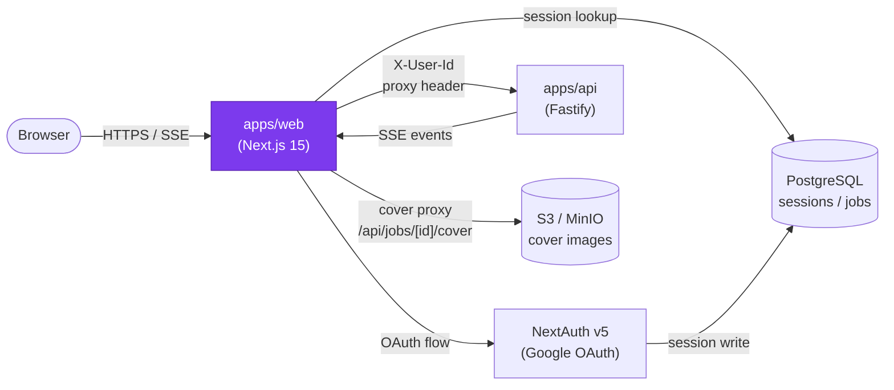

# apps/web — Design Document

> **[AI 開發人員強制指令 / AI Dev Directive]**
> 當你在這個模組下新增任何檔案或修改任何程式邏輯前，你 **必須 (MUST)** 先重新檢視本 `DESIGN.md`。若你的實作方案與本文件的架構規範、職責邊界或設計模式產生衝突，你必須修正你的實作方案以符合設計規範；若你認為必須打破規範，你必須在輸出程式碼前，明確向 User 提出警告並說明原因。

---

## 系統定位 (System Position)

`apps/web` 是使用者唯一的接觸面。它扮演兩個角色：**使用者介面**（Next.js App Router 頁面）與 **BFF（Backend-For-Frontend）代理**（`/api/` 路由將所有請求透過 `X-User-Id` header 轉發至 `apps/api`）。瀏覽器**永遠不**直接與 `apps/api` 通訊。



**此模組是唯一允許：**
- 讀取 `next-auth` session 並注入 `X-User-Id` header 的服務
- 直接渲染給瀏覽器的 React Server Component

---

## 模組職責 (Responsibilities)

- **BFF 代理** — `src/app/api/` 下的所有路由驗證 session、注入 `X-User-Id`，再代理轉發至 `apps/api`。瀏覽器的 CORS 隔離、CSRF 保護均在此層完成
- **認證** — NextAuth v5 整合 Google OAuth；session 存入 PostgreSQL；`AUTH_ENABLED=false` 時自動注入 dev 預設用戶 ID
- **Landing Page** — 行銷首頁，含 PromoComposition 影片展示、功能說明、定價區塊
- **History Vault (`/history`)** — 展示用戶歷史任務，含列表/格狀切換、狀態徽章、封面縮圖、搜尋過濾、Cursor 分頁
- **Billing Page (`/billing`)** — 顯示目前點數餘額與方案，串接 Stripe Checkout（上線時啟用）
- **SSE 進度訂閱** — `useSSE` hook 在生成頁面建立 EventSource 連線，接收 `apps/api` 轉發的 Worker intel，驅動進度條動畫

---

## 關鍵介面與資料流 (Key Interfaces & Data Flow)

### BFF 代理模式

```
瀏覽器 fetch('/api/jobs', { method: 'POST', body: ... })
  → src/app/api/jobs/route.ts
  → getServerSession() 驗證
  → fetch(`${API_URL}/api/jobs`, { headers: { 'X-User-Id': session.user.id } })
  → 回傳 apps/api 的響應
```

### SSE 進度串流

```
useSSE(jobId) hook
  → new EventSource('/api/jobs/{jobId}/stream')
  → src/app/api/jobs/[jobId]/stream/route.ts
  → proxy to apps/api GET /api/jobs/{jobId}/stream
  → 瀏覽器接收 intel JSON → 更新進度條狀態
```

### 封面圖代理

```
<HistoryCard> img src="/api/jobs/{jobId}/cover"
  → src/app/api/jobs/[jobId]/cover/route.ts
  → 從 S3 取得 crawlResult.json，提取 viewportScreenshot URL
  → 307 redirect 至 presigned S3 URL
```

### Auth 注入流程

```
middleware.ts (matcher: /api/*)
  → getToken() 取得 JWT
  → 將 userId 注入 X-User-Id header
  → 如 AUTH_ENABLED=false → 注入 dev userId '1'
```

---

## 🚫 反模式 (Anti-Patterns)

### 1. Client 端直連 apps/api 微服務
瀏覽器若直接呼叫 `http://localhost:3000/api/jobs`（api 服務埠），會遭遇 CORS 封鎖與 session 驗證失敗。**所有 API 呼叫必須透過 apps/web 的 `/api/` BFF 代理路由**，永不例外。這也是 `X-User-Id` 信任邊界的核心設計。

### 2. 在 Server Component 中存取瀏覽器 API
`window`、`document`、`localStorage` 在 RSC 環境中不存在。任何需要這些 API 的元件**必須明確標示 `'use client'`**，且不得在 Server Component 中 `import` 它們，否則會在 Vercel / CI 環境中造成編譯失敗或 Hydration Mismatch。

### 3. 未處理 SSE 斷線重連
`EventSource` 在網路閃斷後不會自動以正確的 `Last-Event-Id` 重連。若不實作重試邏輯，進度條會在斷線後永久卡死在最後一個狀態。`useSSE` hook 必須監聽 `onerror` 事件並在延遲後重建連線，同時有最大重試上限以防無限迴圈。

### 4. 在 BFF 路由中跳過身份驗證
BFF 路由必須在轉發前**強制驗證 session**。若 `getServerSession()` 回傳 `null`，應立即回傳 `401`，絕不允許匿名請求穿透到 `apps/api`。AUTH_ENABLED=false 的 dev 模式是唯一例外，且僅限本地開發環境。

### 5. 在 BFF 層實作業務邏輯
apps/web 的 `/api/` 路由是純代理層，**不應包含任何業務邏輯**（如扣款計算、任務狀態機、點數校驗）。這些邏輯屬於 `apps/api`。代理層只做：驗證 session → 注入 header → 轉發 → 回傳。
