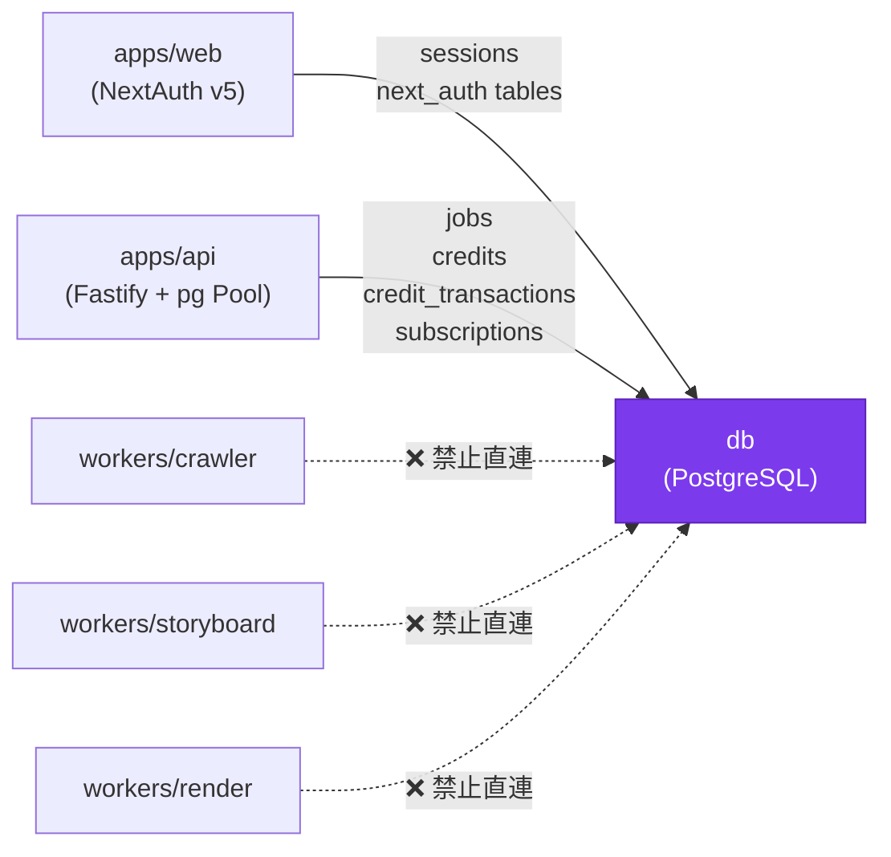

# db — Design Document

> **[AI 開發人員強制指令 / AI Dev Directive]**
> 當你在這個模組下新增任何檔案或修改任何程式邏輯前，你 **必須 (MUST)** 先重新檢視本 `DESIGN.md`。若你的實作方案與本文件的架構規範、職責邊界或設計模式產生衝突，你必須修正你的實作方案以符合設計規範；若你認為必須打破規範，你必須在輸出程式碼前，明確向 User 提出警告並說明原因。

---

## 系統定位 (System Position)

`db/` 是 LumeSpec 的**持久性記憶**。PostgreSQL 儲存所有需要跨 session 保存的業務資料：用戶身份、任務歷史、信用點數帳本、訂閱狀態。它只被 `apps/api` 和 `apps/web`（NextAuth）直接存取，**三個 Worker 服務永遠不直連資料庫**。



**此模組的鐵律：**
- Migration 是唯一可修改 Schema 的方式（不允許手動 `ALTER TABLE`）
- 所有 Migration 必須冪等（可重複執行不報錯）
- Worker 服務永遠不持有 DB 連線

---

## 模組職責 (Responsibilities)

- **Schema 版本管理** — `migrations/` 目錄下的有序 SQL 檔案，由 `apps/api` 啟動時的 `runMigrations()` 自動執行，確保生產與開發環境的 Schema 一致
- **核心業務表** — `users`（NextAuth 用戶）、`jobs`（任務生命週期 + 屬主）、`credits`（點數餘額，含 `SELECT FOR UPDATE` 支援）、`credit_transactions`（不可變的借貸明細帳）
- **訂閱與金流** — `subscriptions`（Stripe 訂閱狀態與 tier）、`stripe_events`（冪等性防護，避免 Webhook 重複處理）
- **效能索引** — `idx_jobs_user_created`（`user_id + created_at DESC`，支援 History Vault 分頁查詢）、`idx_jobs_user_status`（狀態過濾）、`pg_trgm` GIN 索引（intent 全文搜尋）

---

## 關鍵介面與資料流 (Key Interfaces & Data Flow)

### Migration 執行流程

```
apps/api 啟動
  → runMigrations(pool) (apps/api/src/db/migrate.ts)
  → SELECT version FROM schema_migrations ORDER BY version DESC LIMIT 1
  → 執行所有 version > current 的 migrations/*.sql
  → INSERT INTO schema_migrations (version) VALUES (...)
```

### 核心資料表關係

```sql
users (id, email, name, image)           ← NextAuth 用戶
  ↓ 1:N
jobs (id, user_id, status, intent,       ← 任務生命週期
      crawl_result_uri, storyboard_uri,
      video_uri, thumbnail_uri,
      created_at, updated_at)
  
credits (user_id PK, balance)            ← 點數餘額（SELECT FOR UPDATE）
  ↓ 1:N
credit_transactions (id, user_id,        ← 不可變帳本明細
                     job_id, delta,
                     reason, created_at)

subscriptions (user_id PK, tier,         ← Stripe 訂閱狀態
               status, period_end,
               stripe_customer_id,
               stripe_subscription_id)
```

### 點數扣款的交易模式

```sql
BEGIN;
  SELECT balance FROM credits WHERE user_id = $1 FOR UPDATE;
  -- 確認餘額充足
  UPDATE credits SET balance = balance - $cost WHERE user_id = $1;
  INSERT INTO credit_transactions (user_id, job_id, delta, reason)
    VALUES ($1, $jobId, -$cost, 'job_debit');
COMMIT;
```

### 新增 Migration 的正確格式

```sql
-- migrations/005_foo.sql
-- 必須冪等
CREATE TABLE IF NOT EXISTS foo (...);
CREATE INDEX IF NOT EXISTS idx_foo_bar ON foo(bar);
```

---

## 🚫 反模式 (Anti-Patterns)

### 1. 更新狀態時忽略樂觀鎖 / 狀態機檢查
直接 `UPDATE jobs SET status = 'done' WHERE id = $jobId` 可能導致競爭條件：若 Orchestrator 的兩個事件（storyboard.completed 與 render.failed）同時抵達，最後執行的那個會覆蓋前者。**必須在 WHERE 條件中加入 `AND status = 'expected_current_status'`，並檢查 `rowCount` 是否為 1**；若為 0 代表狀態已被其他事件更新，應靜默忽略。

### 2. Worker 直連並修改資料庫
若允許 Worker（crawler/storyboard/render）直接執行 `UPDATE jobs SET ...`，Orchestrator 對任務生命週期的中樞管理即告崩潰。多個 Worker 並發寫入同一任務記錄會造成不可預測的狀態，且失去了 Orchestrator 退款補償的觸發點。**所有任務狀態寫入必須透過 Orchestrator 的事件回調進行**。

### 3. 在扣款交易中同步等待長時間 I/O
在 `BEGIN; ... COMMIT;` 的事務中，若存在 `await fetch(...)` 或 `await delay(...)` 等長時間操作，該事務持有的 Row Lock 會阻塞所有其他試圖讀取或更新同一用戶點數的操作，在高並發下迅速導致連線池耗盡。**扣款事務必須是純 SQL 操作，無任何外部 I/O**。

### 4. 手動 `ALTER TABLE` 修改生產資料庫
直接對生產 DB 執行 `ALTER TABLE` 既不可重現（其他環境的 Schema 會偏離），也無法回溯（沒有 down migration）。**所有 Schema 變更必須寫成 `migrations/00N_description.sql`**，透過 `runMigrations()` 統一管理，確保每個環境（本地 / CI / 生產）的 Schema 完全一致。

### 5. 在 credit_transactions 中更新或刪除記錄
`credit_transactions` 是不可變的**帳本**（Append-Only Ledger）。若要退款，必須新增一筆 `delta = +N, reason = 'refund'` 的記錄，而非修改或刪除原始的扣款記錄。歷史帳本的完整性是稽核與爭議解決的基礎。
