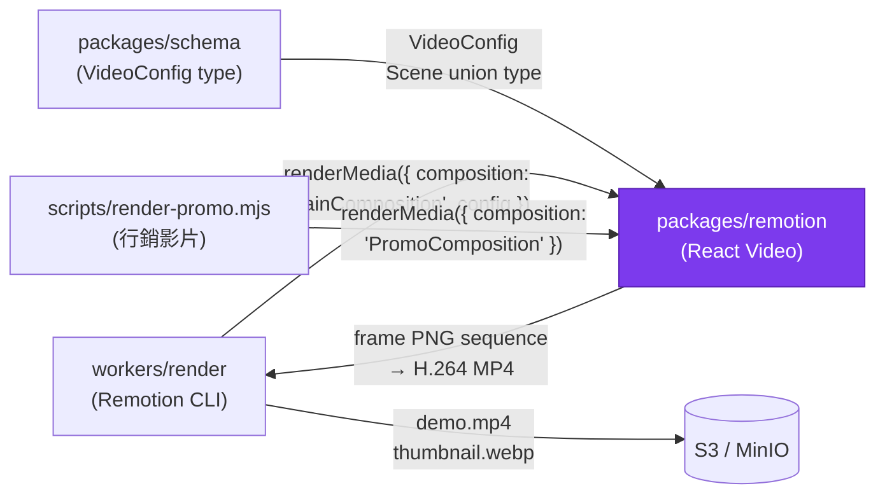

# packages/remotion — Design Document

> **[AI 開發人員強制指令 / AI Dev Directive]**
> 當你在這個模組下新增任何程式邏輯前，你 **必須 (MUST)** 先重新檢視本 `DESIGN.md`。若你的實作方案與本文件的架構規範、職責邊界或設計模式產生衝突，你必須修正你的實作方案以符合設計規範；若你認為必須打破規範，你必須在輸出程式碼前，明確向 User 提出警告並說明原因。

---

## 系統定位 (System Position)

`packages/remotion` 是 LumeSpec 的**視覺渲染引擎**。它是一個純 React 套件，對外提供 `MainComposition`（主影片）與 `PromoComposition`（行銷示範影片）兩個 Remotion 合成元件。它**不知道**自己是被 Worker 驅動還是被 Remotion Studio 預覽，只負責「給定 storyboard config，渲染對應的畫面」。



**此套件的鐵律：**
- 不依賴 `apps/api`、任何 Worker、PostgreSQL、Redis
- 所有動畫必須透過 `useCurrentFrame()` 驅動（Remotion 時間軸確定性）
- 新增場景必須同步在 `packages/schema` 定義對應的 Zod Schema

---

## 模組職責 (Responsibilities)

- **MainComposition** — 讀取 `VideoConfig`，透過 `resolveScene.tsx` 將場景 discriminated union 映射至對應的 React 元件，按順序渲染每個場景
- **場景元件庫（8 種）** — `FeatureCallout`（4 個 variant）、`HeroRealShot`（Ken Burns 效果的截圖展示）、`BentoGrid`（非對稱卡片 grid）、`StatsCounter`（數字滾動動畫）、`ReviewMarquee`（水平滾動評論條）、`LogoCloud`（無限滾動 Logo 走馬燈）、`CodeToUI`（打字機程式碼 + 截圖 transition）、`DeviceMockup`（hero opener — 暗色筆電外殼 + Pan/Zoom 推拉鏡頭 + 靜態文案錨點；運鏡使用 Remotion 內建 `Easing.out/inOut(Easing.cubic)` 確保跨 scene 一致）
- **Watermark** — `<Watermark />` 元件在 `showWatermark=true` 時疊加在每個場景右下角，由 `MainComposition` 統一控制，場景元件本身無感知
- **PromoComposition** — 固定劇本的行銷示範影片，包含所有場景類型的精選展示，由 `pnpm lume render:promo` 獨立渲染
- **primitives/** — 共享的動畫 primitive：`SpringFade`、`SlideIn`、`deriveTheme`（品牌色計算，必須 `useMemo`）

---

## 關鍵介面與資料流 (Key Interfaces & Data Flow)

### MainComposition 渲染邏輯

```typescript
// 入口：packages/remotion/src/MainComposition.tsx
const MainComposition: React.FC<VideoConfig> = (videoConfig) => {
  const frame = useCurrentFrame();
  // 計算當前場景（依 durationInFrames 累加）
  const { scene, localFrame } = resolveCurrentScene(videoConfig.scenes, frame);
  return (
    <>
      {resolveScene(scene, localFrame, videoConfig)}
      {videoConfig.showWatermark && <Watermark />}
    </>
  );
};
```

### 新增場景的正確流程

```
1. packages/schema: 定義 FooScene Zod Schema，加入 Scene union
2. packages/remotion/src/scenes/FooScene.tsx: 實作 React 元件
   - Props 類型直接從 schema infer: type Props = z.infer<typeof FooSceneSchema>
   - 動畫全部使用 useCurrentFrame() + interpolate() / spring()
   - 不使用 setTimeout / setInterval / useEffect 做動畫
3. packages/remotion/src/resolveScene.tsx: 加入 case 'foo-scene'
4. workers/storyboard: 在 prompt 加入場景描述與資料門控條件
```

### 品牌主題計算

```typescript
// ❌ 錯誤：每幀重新計算（30fps × N 個元件 = 效能災難）
const theme = deriveTheme(colors);

// ✅ 正確：用 useMemo 快取
const theme = useMemo(() => deriveTheme(colors), [colors]);
```

---

## 🚫 反模式 (Anti-Patterns)

### 1. 在渲染迴圈中忽略 `useMemo`
`deriveTheme(colors)` 涉及色彩對比計算與調色板生成。在 30fps 的渲染環境下，每幀都重新計算此函式意味著每秒 30 次高昂的計算，在含多個場景的長影片中會造成嚴重的效能瓶頸，甚至記憶體溢出。**所有昂貴的衍生值必須包在 `useMemo` 中**，並正確設定 dependency array。

### 2. 使用 `setTimeout` 或 `useEffect` 驅動動畫
Remotion 的渲染是**確定性的**（同一幀永遠輸出同一畫面）。`setTimeout` 和 `useEffect` 的執行時機依賴真實時鐘，在無頭渲染環境中行為不可預測，會導致不同渲染批次輸出不一致的幀。**所有動畫必須只依賴 `useCurrentFrame()` + `interpolate()` / `spring()`**。

### 3. 未設定字體同步載入（FontSwap / FOUT）
若從外部 CDN（如 Google Fonts）引入字體，在 Remotion 無頭 Chromium 截取時，字體可能尚未載入完成，導致前幾幀出現系統字體（Font Flash / FOUT）。**必須使用 Remotion 的 `staticFile()` 載入本地字體，或使用 `@remotion/google-fonts` 確保字體同步載入後再渲染**。

### 4. 場景元件感知 `showWatermark`
`showWatermark` 是 **全域影片層級**的概念，由 `MainComposition` 統一處理。各場景元件不應接受 `showWatermark` prop，也不應自行渲染 `<Watermark />`。若每個場景都自行渲染水印，未來修改水印樣式需要改動所有場景，造成維護地獄。

### 5. 在 `packages/remotion` 中引入 Node.js 模組
此套件運行在 Remotion Studio（瀏覽器環境）和 Chromium headless 渲染環境中。引入 `fs`、`path`、`crypto` 等 Node.js 原生模組會導致在瀏覽器環境中崩潰。所有檔案 I/O 必須由 `workers/render` 在呼叫 `renderMedia` 前完成，資料透過 props 傳入。

### 6. 把 hero scene 的標題塞進動畫元素裡
若 hero opener 的 headline 跟著裝置/截圖一起做 Pan/Zoom，文字會在運鏡中模糊或偏離可讀區。**Hero opener 的 headline + subtitle 必須是靜止 anchor**，唯有裝置/截圖層做 transform。這樣文字反而成為穩定的視覺重力中心，跟動態元素產生空間張力。範例：`DeviceMockup` 把 headline 放在 70% Y 軸位置、不帶 transform。

`resolveScene` 對 `DeviceMockup` 採用兩級 cascade fallback：viewport 缺失 → `TextPunch`（`HeroRealShot` 也依賴 viewport，無法承接資料缺口）；`device='phone'` 但有 screenshot → `HeroRealShot`。不可把兩種失敗模式合併到同一個 fallback：data gap 與 capability gap 性質不同，混用會把空字串當作 `screenshotUrl` 傳進 ``，於渲染期才崩潰。
