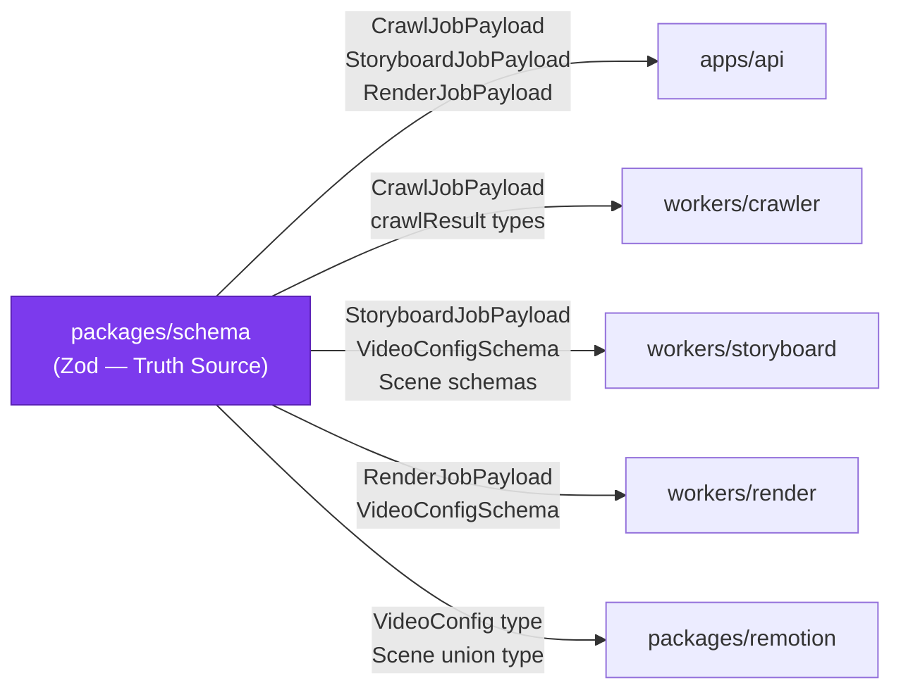

# packages/schema — Design Document

> **[AI 開發人員強制指令 / AI Dev Directive]**
> 當你在這個模組下新增任何檔案或修改任何程式邏輯前，你 **必須 (MUST)** 先重新檢視本 `DESIGN.md`。若你的實作方案與本文件的架構規範、職責邊界或設計模式產生衝突，你必須修正你的實作方案以符合設計規範；若你認為必須打破規範，你必須在輸出程式碼前，明確向 User 提出警告並說明原因。

---

## 系統定位 (System Position)

`packages/schema` 是整個系統的**唯一 Truth Source**。所有跨模組的資料結構（BullMQ payload、Storyboard JSON、場景 Schema）都在此定義，並以 Zod Schema + TypeScript 類型的形式導出。所有消費者（API、所有 Worker、Remotion）都依賴此套件，此套件本身**零依賴於任何框架**。



**此套件的鐵律：**
- 不 `import` 任何框架（React、Fastify、Next.js、BullMQ 均禁止）
- 不含任何副作用（無 I/O、無網路呼叫、無狀態）
- 所有導出的 Schema 都必須同時導出對應的 `z.infer<>` TypeScript 類型

---

## 模組職責 (Responsibilities)

- **BullMQ Payload Schema** — 定義三個 Worker 的任務輸入格式：`CrawlJobPayload`、`StoryboardJobPayload`、`RenderJobPayload`；Orchestrator 使用這些類型建立任務，Worker 使用 `.parse()` 驗證輸入
- **Storyboard/Video Schema** — 核心的 `VideoConfigSchema`（含 `showWatermark`、`fps`、`scenes`）以及所有場景類型的 discriminated union，是 Claude 輸出驗證的 Zod 防火牆
- **場景 Schema（discriminated union）** — 目前支援：`FeatureCallout`、`HeroRealShot`、`BentoGrid`、`StatsCounter`、`ReviewMarquee`、`LogoCloud`、`CodeToUI`、`DeviceMockup`；新增場景類型**必須在此先定義 Zod Schema**，再到 `packages/remotion` 實作 React 元件
  - **DeviceMockup** — hero-opener scene wrapping a viewport screenshot in a dark laptop shell with cinematic Pan/Zoom motion. Schema reserves `device: 'laptop' | 'phone'` for future phone-viewport crawler capture.
- **共享工具類型** — `S3Uri`、`Tier`、`CircuitState` 等跨模組使用的基礎類型

---

## 關鍵介面與資料流 (Key Interfaces & Data Flow)

### 消費模式

```typescript
// Worker 收到 BullMQ 任務後的第一行應為：
const payload = CrawlJobPayload.parse(job.data);  // 若格式不符則立即 throw

// storyboard worker 驗證 Claude 輸出：
const videoConfig = VideoConfigSchema.parse(rawJson);  // 7 層防護的 Layer 2
```

### 場景 Discriminated Union 結構

```typescript
type Scene =
  | { type: 'feature-callout'; variant: '...'; headline: string; ... }
  | { type: 'hero-real-shot'; screenshot: string; ... }
  | { type: 'bento-grid'; items: BentoItem[]; ... }
  | { type: 'stats-counter'; stats: Stat[]; ... }
  | { type: 'review-marquee'; reviews: Review[]; ... }
  | { type: 'logo-cloud'; logos: Logo[]; ... }
  | { type: 'code-to-ui'; codeSnippet: string; ... }
```

### 新增場景的正確順序

```
1. packages/schema/src/scenes/ 定義新 Zod Schema 並加入 union
2. packages/schema/src/index.ts 導出新類型
3. packages/remotion/src/scenes/ 新增對應 React 元件
4. packages/remotion/src/resolveScene.tsx 加入新 case
5. workers/storyboard 的 prompt 加入新場景描述（含資料門控條件）
```

---

## 🚫 反模式 (Anti-Patterns)

### 1. 混入 Framework 依賴
在 `packages/schema` 中 `import React` 或使用 `process.env`、`fs` 等 Node.js API，會導致消費者（如瀏覽器端的 Remotion Studio）編譯崩潰。此套件必須是純 Zod + TypeScript，可在任何環境（Node.js、瀏覽器、Edge Runtime）中安全運行。

### 2. 定義鬆散的型別（Loose Types）
大量使用 `z.any()`、`z.unknown()`、`z.record(z.string(), z.any())` 等鬆散類型，等於讓 Claude 輸出的任意髒資料直接進入渲染引擎，最終在 3am 崩潰渲染任務。**所有欄位必須明確定義類型、加上 `.min()` / `.max()` 等約束、設定合理的 `.default()`**。

### 3. 遺漏 Type Export
定義了 `const FooSchema = z.object({...})` 卻沒有導出 `export type Foo = z.infer<typeof FooSchema>`，導致消費者必須自己推斷或使用 `any`，破壞了 Single Source of Truth 的核心價值。**每個 Schema 必須伴隨一個同名的 type export**。

### 4. 直接修改 Schema 而不更新消費者
`VideoConfigSchema` 是多個模組共享的合約。若在此新增必填欄位（non-optional field），會導致所有已有的 storyboard.json（舊 S3 檔案）無法通過驗證，破壞歷史任務的重播功能。**新增欄位必須使用 `.optional()` 或提供 `.default()`，並在 CHANGELOG 中記錄**。

### 5. 在此套件寫入業務邏輯
`packages/schema` 只負責「描述資料長什麼樣」，不負責「資料應該如何處理」。場景數量上限、幀數計算、watermark 強制覆寫等邏輯屬於 `workers/storyboard`，不應放在 Schema 定義中。
