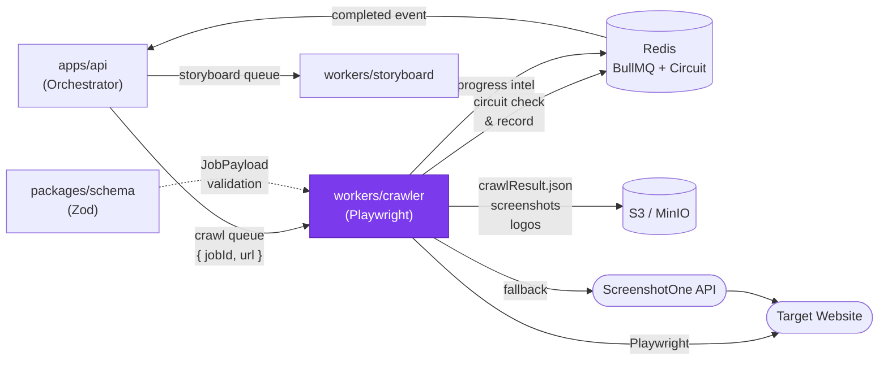

# workers/crawler — Design Document

> **[AI 開發人員強制指令 / AI Dev Directive]**
> 當你在這個模組下新增任何檔案或修改任何程式邏輯前，你 **必須 (MUST)** 先重新檢視本 `DESIGN.md`。若你的實作方案與本文件的架構規範、職責邊界或設計模式產生衝突，你必須修正你的實作方案以符合設計規範；若你認為必須打破規範，你必須在輸出程式碼前，明確向 User 提出警告並說明原因。

---

## 系統定位 (System Position)

`workers/crawler` 是流水線的**第一關**。它從 BullMQ `crawl` 佇列取得任務，用 Playwright（或降級為 ScreenshotOne / Cheerio）提取目標網頁的截圖、品牌色彩、文字內容、Logo，並將結果上傳至 S3，再由 Orchestrator 接力啟動 storyboard 任務。



**此模組是唯一允許：**
- 啟動無頭 Chromium（Playwright）的服務
- 呼叫 ScreenshotOne 外部 API 的服務
- 寫入 `crawlResult.json` 與截圖至 S3 的服務

---

## 模組職責 (Responsibilities)

- **三軌降級爬蟲 (`runCrawl`)** — Playwright 為主軌，WAF 封鎖時降級至 ScreenshotOne，完全無法截圖時降級至 Cheerio 純文字提取
- **彈窗遮蔽 (`overlayBlocker`)** — 在截圖前注入 CSS，隱藏 GDPR 彈窗、客服 Widget、Cookie Banner 等干擾元素（支援 OneTrust、Intercom、Zendesk 等 20+ 平台）
- **Domain Circuit Breaker (`domainCircuit`)** — Redis 記錄每個 domain 的連續失敗次數；3 次失敗開啟熔斷（30 分鐘冷卻），避免無效 Playwright 任務浪費資源和 IP
- **品牌資產提取** — 從 CSS 變數、Open Graph 標籤、`<link rel="icon">` 提取次色、字型、Logo candidates
- **Brand color tier chain** — primary brand color is resolved by a 3-tier fallback in `orchestrator.ts`: (Tier 0) DOM `background-color` sampling via `colorSampler.pickDominantFromFrequencies` with soft-neutral preference; (Tier 1) `<meta name="theme-color">` extraction via `extractThemeColorFromHtml` on whichever track produced the HTML; (Tier 2) Sharp `.stats().dominant` on the downloaded logo buffer via `extractDominantColorFromImage`; (Tier 3) `DEFAULT_BRAND_COLOR` constant. Per-tier source name is logged to worker stdout (`[crawler] brand color tier=X value=Y jobId=Z`) for grep-able prod observability.
- **S3 上傳** — `viewport.jpg`、`fullpage.jpg`、Logo SVG/PNG、`crawlResult.json` 均上傳至同一 `jobs/{jobId}/` 前綴下

---

## 關鍵介面與資料流 (Key Interfaces & Data Flow)

### BullMQ 任務輸入

```typescript
// packages/schema: CrawlJobPayload
{
  jobId: string;
  url: string;
  userId?: string;
  showWatermark: boolean;
}
```

### 三軌降級邏輯

```
checkCircuit(hostname) → 'open' → throw UnrecoverableError (CIRCUIT_OPEN)
                       → 'half-open-probe-in-flight' → throw UnrecoverableError (CIRCUIT_HALF_OPEN)
                       → 'closed' | 'half-open-probe-claimed' → 繼續

runPlaywrightTrack()
  → kind: 'ok'    → recordSuccess() → 進入 S3 上傳
  → kind: 'blocked' → recordFailure() → runScreenshotOneTrack() fallback
  → kind: 'error'   → recordFailure() → runCheerioTrack() fallback
```

### S3 輸出結構

```
jobs/{jobId}/
  viewport.jpg          ← 1280×720 視口截圖
  fullpage.jpg          ← 全頁滾動截圖
  logo-{hash}.svg|png   ← Logo 候選（0-N 個）
  crawlResult.json      ← 所有提取結果的 JSON，供 storyboard worker 讀取
```

### crawlResult.json 關鍵欄位

```typescript
{
  colors: { primary: string; secondary?: string; };
  fontFamily?: string;
  logoCandidate?: S3Uri;
  logoSrcCandidates: S3Uri[];
  viewportScreenshot: S3Uri;
  fullPageScreenshot: S3Uri;
  codeSnippets: string[];
  features: string[];
  reviews: string[];
}
```

---

## 🚫 反模式 (Anti-Patterns)

### 1. 未過濾干擾元素就截圖
若不注入 `OVERLAY_BLOCKER_CSS`，GDPR 彈窗或 Intercom 客服視窗會出現在截圖正中央，嚴重破壞生成影片的質感。**所有 Playwright 截圖前必須先呼叫 `injectOverlayBlocker(page)`**，這不是 optional 的優化，是品質底線。

### 2. 未在 `finally` 區塊關閉瀏覽器
Playwright 的 Browser instance 必須在任務完成（成功或失敗）後明確關閉。若在 catch 區塊中忘記 `await browser.close()`，無頭 Chromium 進程會殘留在系統中，數十個任務後將導致伺服器 OOM（記憶體耗盡）。

### 3. 過早截圖（僅等待 `networkidle`）
現代 SPA 在 `networkidle` 後仍需要 100-500ms 進行客戶端 hydration 與動畫初始化。若截圖時機過早，會捕獲到白畫面或骨架屏（Skeleton）。必須在 `waitForNetworkIdle` 後額外等待固定延遲（或監聽特定 DOM 元素出現）。

### 4. 繞過 Circuit Breaker 直接呼叫 Playwright
若發現 Circuit Breaker 邏輯「太麻煩」而選擇直接呼叫 `runPlaywrightTrack`，將失去對 WAF 封鎖的防護能力，導致同一 IP 對同一 domain 反覆嘗試，加速被永久封禁。Circuit Breaker 是 IP 保護的第一道防線。

### 5. 直接連接 PostgreSQL
Crawler worker **不持有任何 DB 連線**。所有任務狀態更新透過 BullMQ 事件通知 Orchestrator 處理。若需要用戶資訊（如 tier），由 Orchestrator 在任務建立時注入 payload，不在此 worker 查詢。

### 6. 在 track 層做跨 track 共通的 brand-color 推導
Tracks (`playwrightTrack`, `cheerioTrack`, `screenshotOneTrack`) should produce raw observations from one data source each. Cross-cutting "synthesize a brand color from any signal" logic belongs in the orchestrator, where the tier chain composes them. Putting `<meta theme-color>` extraction in `cheerioTrack` (the pre-2026-04-28 design) made it dead code on the happy path because `pickTrack` is a fallback chain, not a merge — playwright always wins, cheerio never runs. The orchestrator-level chain runs against `intermediate.html` regardless of which track produced it.
