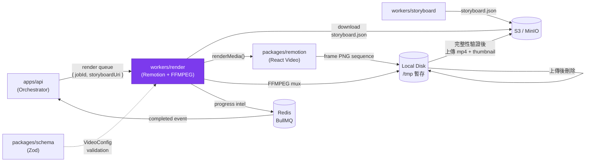

# workers/render — Design Document

> **[AI 開發人員強制指令 / AI Dev Directive]**
> 當你在這個模組下新增任何程式邏輯前，你 **必須 (MUST)** 先重新檢視本 `DESIGN.md`。若你的實作方案與本文件的架構規範、職責邊界或設計模式產生衝突，你必須修正你的實作方案以符合設計規範；若你認為必須打破規範，你必須在輸出程式碼前，明確向 User 提出警告並說明原因。

---

## 系統定位 (System Position)

`workers/render` 是流水線的**最後一關**。它從 S3 讀取 storyboard.json，驅動 `packages/remotion` 透過無頭 Chromium 渲染出 MP4，壓製並上傳至 S3，完成整個生成流水線。



**此模組是唯一允許：**
- 呼叫 `@remotion/renderer` 的 `renderMedia` 與 `renderStill` API 的服務
- 在本地暫存 PNG 序列與 MP4 的服務
- 上傳最終 `demo.mp4` 與 `thumbnail.webp` 至 S3 的服務

---

## 模組職責 (Responsibilities)

- **Remotion 渲染 (`renderMedia`)** — 以 `packages/remotion` 的 `MainComposition` 為入口，依 storyboard.json 的場景序列逐幀渲染，輸出 H.264 MP4（1280×720, 30fps）
- **縮圖生成 (`renderStill`)** — 渲染第 1 幀為 WebP，作為 History Vault 的封面預覽圖
- **原子性上傳** — 先渲染至本地 `/tmp`，完整性驗證通過後再上傳 S3，上傳完成後刪除本地暫存。**絕不直接 Streaming 壓製至 S3**
- **PID 追蹤與 Zombie 清理** — 記錄所有子進程 PID，在 Worker 收到 `SIGTERM` / `SIGINT` 時強制終止所有殘留 Chromium 進程，防止 OOM
- **反壓機制配合** — Orchestrator 的 `backpressure.ts` 會在 render queue 積壓超過閾值時延遲派發，Render Worker 被動配合，不需主動實作限流

---

## 關鍵介面與資料流 (Key Interfaces & Data Flow)

### BullMQ 任務輸入

```typescript
// packages/schema: RenderJobPayload
{
  jobId: string;
  storyboardUri: string;   // S3 URI of storyboard.json
}
```

### 渲染完整流程

```
1. 下載 storyboard.json (S3)
2. VideoConfigSchema.parse(json) — Zod 驗證
3. renderStill({ frame: 0 }) → /tmp/{jobId}/thumbnail.webp
4. renderMedia({ composition: 'MainComposition', config: videoConfig })
     → /tmp/{jobId}/output.mp4
5. 完整性驗證 (fileSize > 0, duration 合理)
6. putObject(s3, bucket, 'jobs/{jobId}/demo.mp4', ...)
7. putObject(s3, bucket, 'jobs/{jobId}/thumbnail.webp', ...)
8. fs.rm('/tmp/{jobId}/', { recursive: true })
9. return { videoUri, thumbnailUri }
```

### S3 輸出結構

```
jobs/{jobId}/
  demo.mp4            ← 最終交付影片 (H.264, 1280×720, 30fps)
  thumbnail.webp      ← 第 1 幀縮圖，供 History Vault 封面使用
```

### 進度上報

```typescript
// Worker 每完成 N% 渲染幀時呼叫：
await job.updateProgress(makeIntel('render', `Rendering frame ${frame}/${total}`));
```

---

## 🚫 反模式 (Anti-Patterns)

### 1. 未清理 Zombie Processes
`renderMedia` 在底層啟動多個 Chromium 子進程。若任務被 BullMQ 強制終止（stall / timeout），而 Worker 沒有在 `SIGTERM` handler 中追蹤並 `kill` 這些子進程，大量 Chromium 殭屍進程會在幾十個任務後耗盡系統記憶體。**必須在 Worker 初始化時設置 PID 追蹤，並在 shutdown hook 中強制清理**。

### 2. 直接在此層修改 React 元件邏輯
若發現某個 Remotion 場景的動畫有問題，**不應在 `workers/render` 中以任何形式修補**（如強制覆蓋 props、hack storyboard JSON）。Render Worker 是純粹的「驅動器」，只負責傳入正確的 config 並啟動渲染。場景邏輯的修正必須在 `packages/remotion` 中進行。

### 3. 直接 Streaming 壓製到 S3 跳過本地暫存
「邊渲染邊上傳」看似更快，但若渲染在 90% 時失敗，S3 上已有一個損壞的不完整 MP4 檔案，且無從得知（S3 不校驗內容完整性）。**必須堅持「先本地渲染完成 → 完整性驗證 → 再上傳 → 再刪除本地」的原子性操作**。

### 4. 忽略 `lockDuration` 設定
Render 任務可能耗時 3-10 分鐘。BullMQ 預設的 lock 時間（30 秒）遠小於此。若未設定足夠長的 `lockDuration`（目前為 600,000ms），BullMQ 會認為 Worker 已死並將任務標記為 stalled，觸發重試並啟動第二個渲染進程與原進程競爭，造成資源浪費和可能的檔案衝突。

### 5. 在 Render Worker 查詢用戶資料
Render Worker 只需要 `storyboardUri`。用戶資訊（tier、watermark 設定）已在 storyboard 生成時注入 storyboard.json 中（`showWatermark` 欄位）。Render Worker **不持有 DB 連線，也不查詢用戶資料**，一切依賴 storyboard.json 的聲明。
