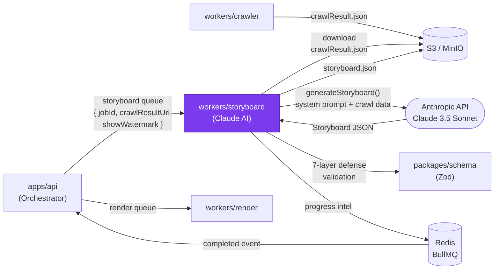

# workers/storyboard — Design Document

> **[AI 開發人員強制指令 / AI Dev Directive]**
> 當你在這個模組下新增任何程式邏輯前，你 **必須 (MUST)** 先重新檢視本 `DESIGN.md`。若你的實作方案與本文件的架構規範、職責邊界或設計模式產生衝突，你必須修正你的實作方案以符合設計規範；若你認為必須打破規範，你必須在輸出程式碼前，明確向 User 提出警告並說明原因。

---

## 系統定位 (System Position)

`workers/storyboard` 是流水線的**創意核心**。它從 S3 讀取爬蟲結果，呼叫 Claude API 生成分鏡腳本（Storyboard JSON），經過七層防護驗證後，將結果存回 S3，再由 Orchestrator 觸發渲染任務。



**此模組是唯一允許：**
- 呼叫 Anthropic Claude API 的服務
- 將 `showWatermark` 欄位寫入 Storyboard JSON 的服務
- 執行 AI 輸出的 7 層防護驗證邏輯的服務

---

## 模組職責 (Responsibilities)

- **Storyboard 生成 (`generateStoryboard`)** — 依據產業類型（fintech / devtools / e-commerce / general）選擇對應的雙語 pacing profile，組裝 system prompt，呼叫 Claude API 並取得結構化 JSON
- **七層防護驗證** — 對 Claude 輸出依序執行：JSON 解析 → Zod Schema 驗證 → 場景數量上限（≤10）→ 總幀數修正（Node.js 計算，非 LLM）→ 文字白名單過濾 → Logo 資料門控 → 水印注入
- **花費守衛 (`spendGuard`)** — 若 `BUDGET_GUARD_ENABLED=true`，在每次 API 呼叫前查詢今日已用 Token 數，超過上限則拋出 `BudgetExceededError`
- **重試策略** — 最多 `MAX_ATTEMPTS` 次重試（預設 3），每次重試前記錄失敗原因，避免無限重試抽乾 Token 配額
- **S3 讀寫** — 下載 `crawlResult.json`（輸入），上傳 `storyboard.json`（輸出）

---

## 關鍵介面與資料流 (Key Interfaces & Data Flow)

### BullMQ 任務輸入

```typescript
// packages/schema: StoryboardJobPayload
{
  jobId: string;
  crawlResultUri: string;   // S3 URI of crawlResult.json
  showWatermark: boolean;
  userId?: string;
}
```

### generateStoryboard 資料流

```
1. 下載 crawlResult.json (S3)
2. 偵測產業類型 (detectIndustry)
3. 選擇 pacing profile (Marketing Hype | Tutorial | General)
4. 組裝 system prompt + user message (含爬蟲數據)
5. claude.messages.create({ model, messages, max_tokens })
6. 解析回應 → extractJSON()
7. 七層防護 (see below)
8. 上傳 storyboard.json (S3)
```

### 七層防護順序

```
Layer 1: JSON.parse() — 解析失敗 → 重試
Layer 2: VideoConfigSchema.parse() — Zod 驗證
Layer 3: 場景數量 clamp (≤ 10)
Layer 4: 幀數重新計算 (durationInFrames = fps × seconds，Node.js 計算)
Layer 5: 文字白名單過濾 (只保留來自爬蟲的原始文字)
Layer 6: Logo 資料門控 (logos 欄位需有真實 S3 URI 才能使用 LogoCloud 場景)
Layer 7: showWatermark 強制注入 (依 payload 覆蓋，不信任 LLM 輸出)
```

### storyboard.json 關鍵欄位

```typescript
// VideoConfig (packages/schema)
{
  fps: 30;
  width: 1280;
  height: 720;
  showWatermark: boolean;
  scenes: Scene[];   // discriminated union by type
}
```

---

## 🚫 反模式 (Anti-Patterns)

### 1. 取消文字白名單限制
若允許 Claude 自由生成產品標語（如「業界最快的 AI 工具」），將造成虛假承諾與品牌風險。**storyboard 中所有顯示給用戶的文字，必須只來自爬蟲提取的原始內容**，不得由 LLM 自由創作。白名單過濾（Layer 5）是法律與品牌的防火牆。

### 2. 將精確數學計算交給 LLM
要求 Claude 計算「10 個場景，每個 90 幀，總計 900 幀」這類精確運算，會大幅提升輸出錯誤率（LLM 對精確算術不可靠）。**幀數、持續時間的計算必須在 Layer 4 由 Node.js 後處理**，Claude 只需給出「幾秒」的意圖，Node.js 負責轉換為精確幀數。

### 3. 無限重試陷阱
Claude API 在高負載時可能連續失敗。若未設定 `MAX_ATTEMPTS` 上限（如 `while(true)`），一個任務可能消耗數千個 Token 仍無輸出，快速抽乾 Anthropic 配額。**必須設置最大重試次數，超過後標記任務失敗並觸發退款**。

### 4. 在此層直接修改渲染邏輯
若發現 Remotion 場景有 bug，不應在 storyboard worker 中「繞路」修正（如強制改寫 storyboard JSON 結構）。正確做法是修正 `packages/remotion` 的場景元件，保持 storyboard JSON 作為中立的 Schema 合約。

### 5. 忽略 `showWatermark` 的強制覆寫
Claude 的輸出中永遠不應信任 `showWatermark` 欄位。即使 LLM 在輸出中寫入了 `showWatermark: false`，Layer 7 也必須依照 payload 中的值強制覆寫，以防止付費功能被繞過。
