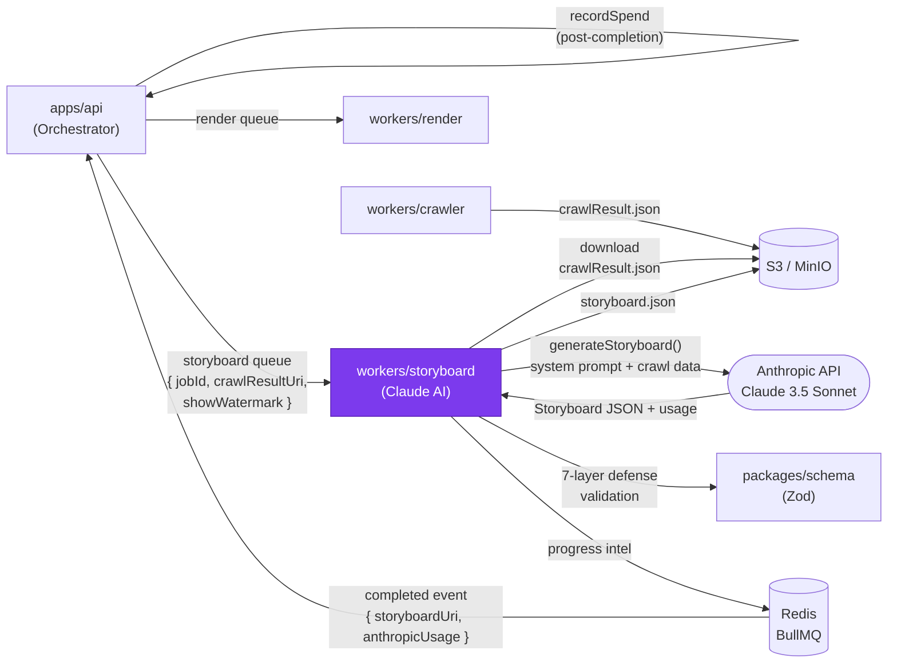

# workers/storyboard — Design Document

> **[AI 開發人員強制指令 / AI Dev Directive]**
> 當你在這個模組下新增任何程式邏輯前，你 **必須 (MUST)** 先重新檢視本 `DESIGN.md`。若你的實作方案與本文件的架構規範、職責邊界或設計模式產生衝突，你必須修正你的實作方案以符合設計規範；若你認為必須打破規範，你必須在輸出程式碼前，明確向 User 提出警告並說明原因。

---

## 系統定位 (System Position)

`workers/storyboard` 是流水線的**創意核心**。它從 S3 讀取爬蟲結果，呼叫 Claude API 生成分鏡腳本（Storyboard JSON），經過七層防護驗證後，將結果存回 S3，再由 Orchestrator 觸發渲染任務。

**此 worker 不持有任何 PostgreSQL 連線。** Anthropic 日花費 gate（pre-flight）與花費記帳（post-flight）都已搬到 `apps/api/src/credits/spendGuard.ts`（Spec 3 R2，2026-04）；worker 只在 BullMQ job result 中回傳 `anthropicUsage`，由 orchestrator 在 `storyboard:completed` 事件中呼叫 `recordSpend` 寫入 DB。



**此模組是唯一允許：**
- 呼叫 Anthropic Claude API 的服務
- 將 `showWatermark` 欄位寫入 Storyboard JSON 的服務
- 執行 AI 輸出的 7 層防護驗證邏輯的服務

**此模組明確禁止：**
- 持有 PostgreSQL 連線、`pg.Pool`、或 `DATABASE_URL` 環境變數的使用

---

## 模組職責 (Responsibilities)

- **Storyboard 生成 (`generateStoryboard`)** — 依據產業類型（fintech / devtools / e-commerce / general）選擇對應的雙語 pacing profile，組裝 system prompt，呼叫 Claude API 並取得結構化 JSON
- **七層防護驗證** — 對 Claude 輸出依序執行：JSON 解析 → Zod Schema 驗證 → 場景數量上限（≤10）→ 總幀數修正（Node.js 計算，非 LLM）→ 文字白名單過濾 → Logo 資料門控 → 水印注入
- **Token 用量累積** — 跨所有重試 attempt 累加 `input_tokens` / `output_tokens` / `cache_read_input_tokens` / `cache_creation_input_tokens` 至 `accUsage`；成功時將 `anthropicUsage: accUsage` 放入 GenerateResult 與 BullMQ job return value 一併回傳給 orchestrator。**worker 不再自行寫入 system_limits 表**
- **重試策略** — 最多 `MAX_ATTEMPTS` 次重試（預設 3），每次重試前記錄失敗原因，避免無限重試抽乾 Token 配額
- **S3 讀寫** — 下載 `crawlResult.json`（輸入），上傳 `storyboard.json`（輸出）
- **開場場景偏好策略** — system prompt 預設使用 `DeviceMockup` 作為第一個場景（當 `viewport` screenshot 存在時），`HeroRealShot` 退化為 fallback。實作於 `sceneTypeCatalog.ts`（catalog 描述）+ `systemPrompt.ts`（CREATIVITY_DIRECTIVE bullet + HARD RULE #9 禁止 `device='phone'`）。
- **`SCENE_PACING_DISCIPLINE` (v1.7)** — new prompt block enforcing soft
  rules: TextPunch ≤ 2 per storyboard, never consecutive, prefer QuoteHero
  for testimonial/customer-voice moments, alternate TextPunch variants for
  visual variety. Soft enforcement only — `textPunchDiscipline` validator
  measures compliance via log telemetry; no hard rejection in Phase 1.
  Wired into `buildSystemPrompt()` immediately after `CREATIVITY_DIRECTIVE`.
- **`SCENE_CATALOG.QuoteHero` (v1.7)** — describes the new scene type with
  explicit data requirements (quote + author both from sourceTexts) and
  discrimination from ReviewMarquee (1 dramatic quote vs 3+ endorsements).
- **`V1_IMPLEMENTED_SCENE_TYPES`** — now includes 'QuoteHero'. Claude is
  told this is in the allowed type list.
- **`SCENE_CATALOG.VersusSplit` (Phase 2)** — describes the new scene with
  closed `compareFraming` enum (4 values), explicit data requirements
  (both .value fields from sourceTexts), and explicit anti-fabrication
  warning. `V1_IMPLEMENTED_SCENE_TYPES` extended to 14 entries.

---

## 關鍵介面與資料流 (Key Interfaces & Data Flow)

### BullMQ 任務輸入

```typescript
// packages/schema: StoryboardJobPayload
{
  jobId: string;
  crawlResultUri: string;   // S3 URI of crawlResult.json
  showWatermark: boolean;
  userId?: string;
}
```

### generateStoryboard 資料流

```
1. 下載 crawlResult.json (S3)
2. 偵測產業類型 (detectIndustry)
3. 選擇 pacing profile (Marketing Hype | Tutorial | General)
4. 組裝 system prompt + user message (含爬蟲數據)
5. claude.messages.create({ model, messages, max_tokens })
6. 解析回應 → extractJSON()
7. 七層防護 (see below)
8. 上傳 storyboard.json (S3)
```

### 七層防護順序

```
Layer 1: JSON.parse() — 解析失敗 → 重試
Layer 2: VideoConfigSchema.parse() — Zod 驗證
Layer 3: 場景數量 clamp (≤ 10)
Layer 4: 幀數重新計算 (durationInFrames = fps × seconds，Node.js 計算)
Layer 5: 文字白名單過濾 (只保留來自爬蟲的原始文字)
         — Pass 1 也對 `joinedPool = pool.join(' ')` 做 substring 包含檢查，
           接住 Claude 合法跨多個 sourceTexts 條目組句的情況（如將 promo
           標題 + 產品列表、testimonial header + body 串起來）。對所有
           場景類型對稱適用。新增 2026-04-28（Burton tech "save up to
           40% off select boards..." 回歸）。
         — `collectSceneTexts` handles `case 'QuoteHero'` (v1.7) — returns
           `[quote, author, attribution]` (attribution included only if
           present). Quote may span multiple sourceTexts entries; relies on
           Pass 1 joinedPool fast-path for cross-entry tolerance.
         — `collectSceneTexts` handles `case 'VersusSplit'` (Phase 2) —
           returns `[headline?, left.value, right.value]`. label fields
           are UI framing (Before/After/Them/Us), intentionally NOT
           extractive-checked — same approach as iconHint.
Layer 6: Logo 資料門控 (logos 欄位需有真實 S3 URI 才能使用 LogoCloud 場景)
Layer 7: showWatermark 強制注入 (依 payload 覆蓋，不信任 LLM 輸出)
```

### Soft validators (post-pipeline telemetry)

- **`textPunchDiscipline` (v1.7 soft validator)** — analyzes the post-validate
  storyboard for TextPunch usage discipline (max 2 per storyboard, never
  consecutive). Always returns a report; never throws or rejects. Caller in
  `index.ts` logs a structured single-line summary
  (`[storyboard-discipline] jobId=... textPunchTotal=... consecutive=...
  violatesMax=... violatesConsec=... variants=...`) for prod telemetry.
  Phase 5+ may decide to upgrade to hard Zod refinement once we accumulate
  ~50+ prod log lines showing Claude's actual compliance pattern.

### storyboard.json 關鍵欄位

```typescript
// VideoConfig (packages/schema)
{
  fps: 30;
  width: 1280;
  height: 720;
  showWatermark: boolean;
  scenes: Scene[];   // discriminated union by type
}
```

---

## 🚫 反模式 (Anti-Patterns)

### 1. 取消文字白名單限制
若允許 Claude 自由生成產品標語（如「業界最快的 AI 工具」），將造成虛假承諾與品牌風險。**storyboard 中所有顯示給用戶的文字，必須只來自爬蟲提取的原始內容**，不得由 LLM 自由創作。白名單過濾（Layer 5）是法律與品牌的防火牆。

### 2. 將精確數學計算交給 LLM
要求 Claude 計算「10 個場景，每個 90 幀，總計 900 幀」這類精確運算，會大幅提升輸出錯誤率（LLM 對精確算術不可靠）。**幀數、持續時間的計算必須在 Layer 4 由 Node.js 後處理**，Claude 只需給出「幾秒」的意圖，Node.js 負責轉換為精確幀數。

### 3. 無限重試陷阱
Claude API 在高負載時可能連續失敗。若未設定 `MAX_ATTEMPTS` 上限（如 `while(true)`），一個任務可能消耗數千個 Token 仍無輸出，快速抽乾 Anthropic 配額。**必須設置最大重試次數，超過後標記任務失敗並觸發退款**。

### 4. 在此層直接修改渲染邏輯
若發現 Remotion 場景有 bug，不應在 storyboard worker 中「繞路」修正（如強制改寫 storyboard JSON 結構）。正確做法是修正 `packages/remotion` 的場景元件，保持 storyboard JSON 作為中立的 Schema 合約。

### 5. 忽略 `showWatermark` 的強制覆寫
Claude 的輸出中永遠不應信任 `showWatermark` 欄位。即使 LLM 在輸出中寫入了 `showWatermark: false`，Layer 7 也必須依照 payload 中的值強制覆寫，以防止付費功能被繞過。

### 6. 在 worker 重新引入 PostgreSQL 連線
Spec 3 R2（2026-04）已將 Anthropic spend guard 與 recordSpend 完整搬到 `apps/api/src/credits/spendGuard.ts`，本 worker 不應再 `import { Pool } from 'pg'` 或讀取 `DATABASE_URL`。任何「需要查 DB 才能決定怎麼跑」的需求，都應該轉成「orchestrator 在入隊前 gate / 在完成後記帳」的模式 — worker 留純粹（純 S3 讀寫 + Claude 呼叫 + Schema 驗證）才能保持中央化的故障與計費邊界。

### 7. 在 scene-type discriminated switch 漏 `assertNever` default
`validation/extractiveCheck.ts:collectSceneTexts` 是 `switch (scene.type)`，每個 case 從 props 抽出需做白名單比對的字串。**必須**有 `default: return assertNever(scene)` 防止 future Scene 類型被忘記 — 否則 switch 會 fall-through 回 `undefined`，呼叫端的 `for (const raw of collectSceneTexts(scene))` 在 prod 拋 `is not a function or its return value is not iterable`，整個 storyboard generation 失敗。2026-04-27 新增 DeviceMockup 時就因為漏這道而出 prod 事件。`assertNever` 把 runtime 失敗轉成編譯期錯誤。
